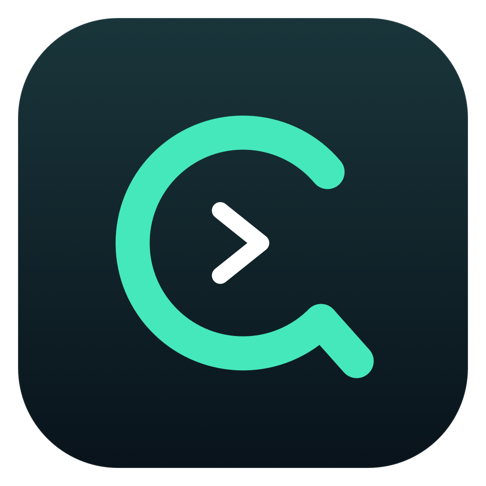

<p align="center"></p>
<h1 align="center">Codex Quota</h1>
<p align="center">把 Codex 剩余额度挂在 macOS 菜单栏上，少点几次，也少焦虑一点。</p>

## 为什么做这个

作者一直对 Codex 的额度有点使用焦虑。

写东西、改代码的时候，总想知道还剩多少额度、什么时候恢复。每次都得点开查看，看完关掉，过一会儿又想看。额度不能常驻在眼前，这件事让人挺烦躁。

所以做了这个很小的挂件：把剩余额度放进菜单栏，抬头就能看到。想看细节时点开，不想管的时候就让它安静待着。

## 灵感来源

灵感来自炉子里 **@禾川** 发布的《分享一个Codex对话提醒的方案》。感谢这篇帖子和开源项目带来的启发，让我也想为自己的 macOS 做一个随时能看到 Codex 额度的小挂件。

原项目：[Vincent-hechuan/codex-quota-band](https://github.com/Vincent-hechuan/codex-quota-band)。

## 能做什么

- 菜单栏常驻显示主 Codex 额度的剩余百分比。
- 点击查看额度窗口、进度条、重置时间及最后更新时间。
- 每 60 秒自动刷新，支持手动刷新和休眠唤醒后刷新。
- 可将详情固定为桌面置顶小面板。
- 分开展示接口返回的不同额度组；未返回的数据不会编造成 100%。
- 连接失败会标注状态；本次运行的旧数据会标成过期。
- 可在「更多」中设置登录启动，由 macOS 管理授权。

这是独立的社区小工具，与 OpenAI 无隶属或背书关系。它监控 **Codex 接口实际返回的额度**，并不覆盖 ChatGPT 普通聊天、图片、深度研究等所有额度。

## 安装与使用

要求：**macOS 14 或更新版本**，以及已经登录的官方 **Codex 桌面 App**。

### 使用下载版

1. 从 [Releases](https://github.com/MKL-bot1/codex-quota/releases) 下载 `Codex-Quota-v1.1.1-macOS-universal.zip`。
2. 解压，将 `Codex Quota.app` 放到「应用程序」或个人 `~/Applications` 文件夹。
3. 打开小工具，在屏幕顶部菜单栏找到图标和百分比。首次查询可能需要数秒。
4. 点击菜单栏项查看详情，点击图钉打开桌面面板。关闭面板不会退出菜单栏工具。
5. 「更多」菜单提供刷新之外的登录启动、打开 Codex 和退出操作。

下载版是 **Apple Silicon / Intel 通用二进制**，使用临时签名，**未经过 Apple Developer ID 签名和公证**。macOS 可能拦截首次启动。如果系统不允许打开，可使用下方源码构建方式；本项目不提供关闭 Gatekeeper、清除全局安全设置的命令。

发布页附 SHA-256 校验文件，可在下载目录执行：

```sh
shasum -a 256 -c SHA256SUMS.txt
```

### 从源码构建

安装 Xcode 或 Xcode Command Line Tools，确保 `xcrun swiftc` 可用，然后：

```sh
git clone https://github.com/MKL-bot1/codex-quota.git
cd codex-quota
./build.sh
open "dist/Codex Quota.app"
```

构建仅使用本机 Swift 编译器和 Apple 系统框架，不安装第三方依赖，不下载 Codex。产物在 `dist/`，构建会运行不联网的自检。构建时需要支持 macOS 14 SDK 的工具链；旧编译器可能需要升级。

> 已在 Apple Silicon Mac 上验证编译、实际查询、刷新及界面。Intel 架构已编译并检查，但没有在 Intel 实机运行。

## 数据与账号怎么处理

**下载的是程序，不是作者的账号。每个使用者都必须在自己的 Mac 上登录 Codex。**

- 发布包不包含账号、登录令牌、Cookie、API Key、Codex 配置、聊天历史、额度缓存或作者的真实额度截图。
- 小工具不直接读取或复制 `auth.json`、浏览器数据或钥匙串凭据；登录认证由你已安装的 Codex 处理。
- 额度仅保存在小工具内存中，退出即丢弃；下次启动重新查询。
- 不设开发者后台，不加入埋点、广告、自动更新器或错误上报服务。
- 只发送初始化和额度读取请求；不创建对话、不调用模型、不购买积分、不兑换额度重置。
- 通过私有标准输入/输出管道连接 Codex，不监听网络端口。
- 只自动使用签名有效、发布者匹配 OpenAI 的 Codex App；不自动执行 PATH 里的任意 `codex`。

**边界也说明白：** 认证联网由 Codex 完成，它仍按自己的实现和用户配置使用本机登录状态，可能写入自身日志或状态。小工具不是 Codex 的权限沙箱，也不能保证外部 Codex 完全不写文件。切换账号后建议重启小工具，以确保重新连接。

详细检查范围见 [安全与隐私说明](SECURITY.md)。

## 常见问题

**显示“未找到有效签名的 Codex”？**

当前支持在 `/Applications` 或 `~/Applications` 中名为 `Codex.app` 或 `ChatGPT.app`、且实际 bundle ID 为 `com.openai.codex` 的官方桌面应用。普通 ChatGPT 聊天 App、CLI 单独安装或修改过签名的 App 不在这个版本的自动发现范围。请先安装并登录官方 Codex。

**为什么少了五小时或每周额度？**

接口不一定给所有账号返回相同窗口；没有提供就不显示。不同模型/额度组分别展示，具体限制以官方账号页面为准。

**菜单栏有 `!` 或数据显示过期？**

可能是网络、登录状态、依赖更新或接口变化。先在 Codex 里确认可用，再点击刷新或重启小工具。服务端更新时间也可能滞后，这不是逐秒精确计费仪表。

**只装 CLI 能用吗？**

这个公开版本只自动连接经过签名验证的官方桌面 App，以减少错误执行其他程序的风险。

**要什么权限？**

日常使用不需要管理员、辅助功能、录屏或完全磁盘访问权限。只有选择「登录时启动」时，才可能需要系统登录项确认。

## 开发

- `Sources/main.swift`：界面、额度读取、进程与账号边界。
- `assets/`：Logo、菜单栏模板图标和 App 图标。
- `scripts/render-icons.swift`：图标生成源码。
- `build.sh`：通用二进制构建、临时签名及自检。
- `scripts/check-release.py`：公开包敏感内容和文件清单检查。

接口依据：[Codex App Server 官方文档](https://learn.chatgpt.com/docs/app-server)。上游接口、签名和安装布局变化可能需要适配。

MIT License。欢迎 Issue 和 Pull Request；**请勿上传自己的账号凭据、完整配置或未脱敏日志。**

## v1.1.1 修复

修复菜单栏弹窗加载后只显示下半部分的问题：在打开前明确设置弹窗及承载视图尺寸，并根据所在屏幕的可用高度调整列表区域；加载与读取完成使用一致尺寸。保留原有毛玻璃外观。桌面面板同步使用相同的尺寸规则。

从早期本地版升级时，请先退出并移除旧版 App 的登录项，再保留一份新版本，以免不同应用标识的旧版与公开版同时运行。
